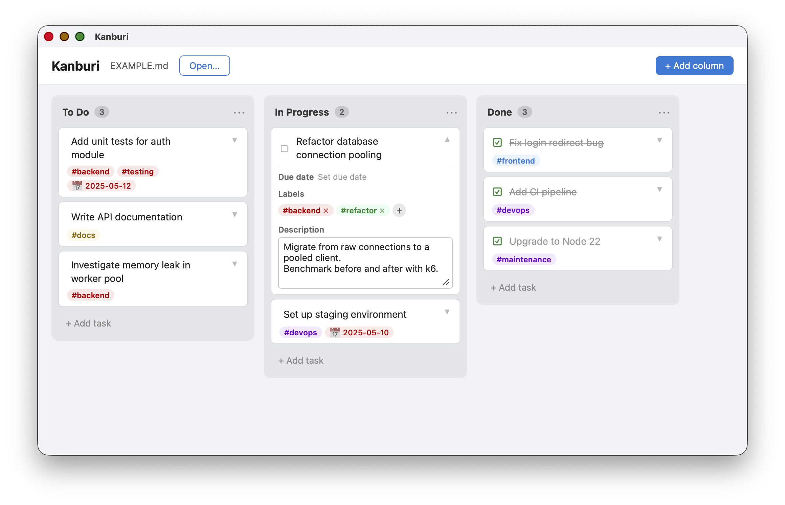

# Kanburi



A native desktop Kanban board that saves everything in a single, human-readable Markdown file — no database, no account, no sync service required.

---

## Features

- Drag cards between columns
- Labels, due dates, and descriptions per card
- All data persisted in a plain `.md` file you own

---

## Getting started

1. Launch **Kanburi**.
2. Click **Open file** and choose (or create) a `.md` file.
3. Your board loads from that file. Changes are saved automatically.

> **Tip:** Keep your board file in a cloud-synced folder (iCloud Drive, Dropbox, etc.) to access it from multiple machines.

---

## Markdown file format

```markdown
# Tasks

## To Do

- [ ] Add unit tests for auth module #backend #testing @2025-05-12
- [ ] Write API documentation #docs
- [ ] Investigate memory leak in worker pool #backend
  Observed in production since v1.4. Check thread cleanup on timeout.

## In Progress

- [ ] Refactor database connection pooling #backend #refactor
  Migrate from raw connections to a pooled client.
  Benchmark before and after with k6.
- [ ] Set up staging environment #devops @2025-05-10

## Done

- [x] Fix login redirect bug #frontend
- [x] Add CI pipeline #devops
  Runs lint, test, and build on every pull request.
- [x] Upgrade to Node 22 #maintenance
```

- Each `##` heading is a column.
- Each `- [ ]` / `- [x]` line is a task (`[x]` = done).
- `#Label` adds a label to the task (multiple allowed).
- `@YYYY-MM-DD` sets the due date.
- Lines indented with 2 spaces below a task are its description (multi-line supported).

---

## Contributing

See [CONTRIBUTING.md](./CONTRIBUTING.md) for development setup, build instructions, and architecture notes.
